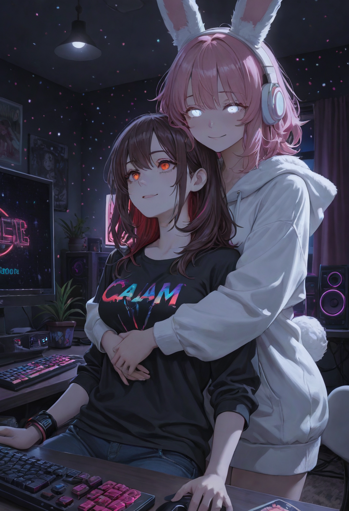

# Saya Couple

> I wanted two characters and a background to stop fighting each other. This got slightly out of hand.

Saya Couple is a ComfyUI custom node pack **plus a small patch to ComfyUI's attention code**. It lets one
generation use three separate conditionings that actually work together:

- **MAIN**: the world. Scene, background, mood, colours, overall composition.
- **P1**: the first character's identity and attributes.
- **P2**: the second character's identity and attributes.

It is first and foremost **a backup of my own ComfyUI setup**, made public in case it helps someone with the
same problem. Take what you need.



---

## ⚠️ Installation warning

**Saya Couple modifies ComfyUI's own files.** It is not a plain "drop it in `custom_nodes`" extension.

- a ComfyUI update can overwrite or break the patch;
- another extension can modify the same files;
- a ComfyUI version that was not tested may work, or may not;
- a bad install can break ComfyUI;
- the optional AMD patch also changes how ComfyUI loads and unloads models.

### BACK UP YOUR OWN COMFYUI INSTALLATION BEFORE INSTALLING.

The installer checks compatibility first, keeps its own backup, verifies hashes and can restore, but your own
copy is the one you can trust. **Use at your own risk.** Nothing dramatic: the changes are small text patches and
they can be reverted.

---

## What is Saya Couple?

| Part | What it is | Needed? |
|---|---|---|
| **Core patch** `comfy/ldm/modules/attention.py` | makes MAIN / P1 / P2 cooperate inside cross-attention | **required** for the couple mode |
| **Custom node pack** `custom_nodes/Saya_Couple/` (53 nodes) | the couple nodes, plus many nodes my own workflow uses (phase checkpoints, HiDream helpers, upscale/detail passes, lazy loaders…) | install it all, ignore what you don't use |
| **AMD VRAM safety patch** `comfy/model_management.py` | keeps ROCm from starving the Linux desktop of VRAM | optional, AMD only |
| **Installer** `./saya` | install / verify / restore / check-compat | recommended |
| **Demo workflow** (simple) | MAIN / P1 / P2 + the two Shark samplers, nothing else | recommended first run |
| **Full workflow** | my complete 6-phase pipeline, cleaned for publication | for when you want everything |
| **Tests & tools** | proofs, installer scenarios, test campaigns | if you're curious |

## Why this exists

I wanted one image with a rich scene and two distinct characters, each with their own prompt.

With the usual approaches (regional prompting, attention couple, conditioning combine/concat), the three
conditionings **compete**. If the characters win, they come out great but absorb MAIN's authority: the background
gets simpler, requested objects go missing, colours and mood fade. If you push MAIN harder, the characters degrade
or start merging into each other.

I wanted to **control** how MAIN, P1 and P2 share the image instead of choosing which one loses.

## How it works

For every cross-attention layer of the model that runs the couple (MODEL_1):

1. **MAIN** is computed exactly as ComfyUI normally does (native path).
2. **P1** and **P2** are computed separately, with the same layer, on the conditional rows only.
3. Inside each character's mask, the character's difference from MAIN (its **delta**) is added on top of MAIN.
   The part of the delta that would cancel MAIN is removed ("locked" orthogonal to MAIN), so a character adds
   information without erasing the scene.
4. The negative/unconditional side stays pure MAIN.

```
OUT = MAIN + g × (D1_locked + D2_locked)
```

The lesson from many failed attempts (weights, scheduling, mask variants, routing, alternative cores; see
[docs/DEVELOPMENT_HISTORY.md](docs/DEVELOPMENT_HISTORY.md)): **before tuning how strong MAIN, P1 and P2 are, you
first have to control *how* they interact inside attention.** That needed a core modification. Once the interaction
was clean, the balance became a single knob, `g`.

| g | what tends to happen |
|---|---|
| too low (≈ 0.5) | MAIN gets strong (richer, more colourful background), characters start losing attributes |
| too high (≥ 0.83) | the characters take over the frame; MAIN loses objects and detail |
| **≈ 0.78** | current compromise: MAIN, P1 and P2 all contribute |

The goal is not "zero defects". It is that **MAIN, P1 and P2 can all contribute together.**

The couple mode is **fail-closed**: other extensions that hook cross-attention (attn2 patches, attn2 replacements,
attention overrides) raise a clear error in that mode instead of being silently mixed in.

## Current recommended balance

```python
# comfy/ldm/modules/attention.py
SAYA_LOCKED_DELTA_PERSON_GAIN = 0.78
```

- **1.0** is the **neutral reference**. It is proven bit-identical to the patch before the gain existed.
- **0.78** is the **current recommended value**, chosen after pure-RNG campaigns and tests across ten different
  environments. It is a good compromise *for my models and prompts*, not a universal constant. A nearby value may
  suit your content better.

To change it, edit that line and restart ComfyUI. There is deliberately no widget for it.

## Compatibility

Compatibility is decided from **what your ComfyUI's code actually provides**, not from its version number. An old
version is never refused just for being old.

| Status | Meaning |
|---|---|
| **OFFICIALLY TESTED** | every key core file is byte-identical to the version validated with real generations |
| **POTENTIALLY SUPPORTED** | all structures/APIs Saya uses are present and the patch applies; not validated with real generations |
| **UNSUPPORTED** | something required is missing, or the patch does not apply → the installer changes nothing |

It is checked on three separate axes:

- **A. Saya attention core**: does the patch apply, and are the runtime hooks it uses present (`cond_or_uncond`,
  `activations_shape`, attention backends accepting `transformer_options`)?
- **B. Custom node pack**: are all 128 ComfyUI imports/symbols the pack uses present (for example
  `comfy.model_base.Anima` and `model_management.unload_model_and_clones`), and is **MultiMaskCouple** installed?
- **C. AMD patch**: does it apply to your `model_management.py`?

Tested setup (OFFICIALLY TESTED): ComfyUI `41db8f4f` (v0.34.0 + 77 commits, 2026-09-08), Linux, AMD Radeon RX 9060 XT
16 GB (RDNA4), ROCm 7.13, PyTorch 2.13, Python 3.12, PyTorch attention.

Static scan of past releases (`compatibility.json`, `tools/scan_history.py`):

| ComfyUI | A. attention | B. pack | C. AMD patch |
|---|---|---|---|
| ≤ v0.3.59 | UNSUPPORTED (attention backends don't take `transformer_options`) | UNSUPPORTED | UNSUPPORTED |
| v0.3.69 – v0.22.x | POTENTIALLY SUPPORTED | UNSUPPORTED (APIs added later) | POTENTIALLY SUPPORTED |
| v0.23.0 – v0.37.4 | POTENTIALLY SUPPORTED | POTENTIALLY SUPPORTED | POTENTIALLY SUPPORTED |

So in practice: **v0.23.0 or newer** is needed; only the tested commit is OFFICIALLY TESTED. Run
`./saya check-compat` on your own install; it is the answer that counts.

## Core files modified

Verified against upstream: exactly **two** ComfyUI files are touched, nothing else in the core.

### REQUIRED CORE MODIFICATION: `comfy/ldm/modules/attention.py`

- Adds the Saya cross-attention path used only when a model carries `saya_dual_mode` (set by the Saya Multi Couple
  node): MAIN native, P1/P2 on conditional rows, `main_locked_delta` fusion, `SAYA_LOCKED_DELTA_PERSON_GAIN = 0.78`,
  fail-closed hook checks.
- Without the flag the file behaves exactly like upstream (tested bit-identical).
- About 120 added lines, one changed line (`if` → `elif`). Patch: `patches/saya_dual_attention.patch`.

### OPTIONAL AMD SAFETY PATCH: `comfy/model_management.py`

About 20 lines, active only on AMD GPUs under ROCm. Not needed for Saya Couple. See below.

### CUSTOM NODE FILES

`custom_nodes/Saya_Couple/`: a normal custom node folder. It needs the external **MultiMaskCouple** custom node.
The per-file list with sha256, origin and license is in `MANIFEST.json`.

## AMD VRAM safety patch (optional)

On Linux with amdgpu, ROCm allocations cannot be evicted for other programs. When PyTorch fills the VRAM, the
desktop compositor can fail to allocate and the **whole graphical session can freeze or die**. Switching between big
models (SDXL → HiDream + LoRA) could also run out of memory.

The patch (a no-op on NVIDIA, CPU and anything that is not ROCm):

- caps ComfyUI's VRAM at startup to *free VRAM − 1 GiB* kept for the desktop, and makes loading decisions respect it;
- unloads models **fully** instead of partially, so gigabytes of the old model don't stay next to the new one;
- never grows an already partially loaded model back into the headroom reserved for activations and LoRA patching.

| AMD VRAM | Installer suggestion |
|---|---|
| ≤ 16 GB | strongly recommended for heavy workflows like mine (asks, default yes, you can refuse) |
| 16 – 24 GB | recommended with big models / heavy workflows (asks, default yes, you can refuse) |
| ≥ 24 GB | information only: generally not needed, not applied (`./saya amd --yes` if you want it) |

NVIDIA users are never offered it. You always keep the choice: `./saya amd --check | --yes | --revert`. Launch flags I use with
it: `--disable-dynamic-vram --reserve-vram 0.75`.

## Installation

Requirements: ComfyUI **v0.23.0+** (see Compatibility), the custom node **MultiMaskCouple**, and **RES4LYF** for the
demo workflow.

```bash
git clone <this repository> saya-couple
cd saya-couple
./saya check-compat --comfyui /path/to/ComfyUI      # changes nothing
./saya install      --comfyui /path/to/ComfyUI      # Windows: saya.bat install --comfyui C:\path\to\ComfyUI
```

What `install` does:

1. finds ComfyUI and its Python (`.venv`, `venv`, `python_embeded`, or `--python`);
2. reads its version/commit and **checks compatibility** on the three axes;
3. shows exactly which core files will change and asks for confirmation;
4. backs up every file it will touch (`ComfyUI/.saya_backups/<date>/`, with sha256 and ComfyUI version);
5. applies the required attention patch (no git needed; a patch that does not match exactly is refused);
6. installs `custom_nodes/Saya_Couple`;
7. offers the AMD patch only when it makes sense;
8. checks hashes, runs quick smoke tests (core import, Saya path live, gain value, pack import) and prints a report.

If a required check fails, **nothing is modified**. Re-running `install` is safe (idempotent). `--dry-run` shows
everything without writing; `--full` also runs the pack's test suite.

## Verify / Restore

After a ComfyUI update, or when something looks off:

```bash
./saya verify --comfyui /path/to/ComfyUI
```

Short, paste-able report: ComfyUI version/commit, compatibility status, attention patch `OK / MODIFIED / MISSING`,
custom node `OK / INCOMPLETE`, AMD patch `ACTIVE / NOT INSTALLED / INCOMPATIBLE`, hashes, dependencies, known
conflicts, quick tests. If you open an issue, please include it: *"Run `./saya verify` and paste the output."*

```bash
./saya restore --comfyui /path/to/ComfyUI
```

puts back **exactly** the files saved before the first install (never a guessed upstream file) and removes the
custom node. If a file changed after the install (update, manual edit), it tells you and asks before overwriting.

## Demo workflow (simple)

`workflows/Saya_Couple_Demo.json`: **SELECT YOUR SDXL / ILLUSTRIOUS MODEL, THEN CLICK GENERATE.**

Deliberately bare: two checkpoint loaders, MAIN / P1 / P2 / negative, the Saya split mask and Multi Couple, the two
Shark samplers, decode, save. No phases, no detailers, no upscale. Load a checkpoint in both loaders once (the same
model in both works), click Generate, and you see the couple mechanism doing its job. Random seed every run.

The sampling core is **exactly the one of my validated setup** (RES4LYF ClownsharKSampler): MODEL_1 base pass
16 steps / 13 run / cfg 6 with Epsilon Scaling → CFGZeroStar → APG → PAG and DetailBoost, then MODEL_2 refine pass
3 steps / denoise 0.5 / cfg 2. The gain 0.78 lives in the patched core, not in the graph. The prompts are the ones
used for the gain campaigns (two adult characters in a seated hug, a dense multicoloured gamer room); only the
negative prompt was reworded to neutral quality terms for the public version.

## Full workflow

`workflows/Saya_Couple_Full.json`: the complete pipeline I actually use, in 6 phases (base sampling, hires / USDU,
HiDream refine, pre-detail refine, detailers, final upscale & naturalize), with phase checkpoints and review gates.

Cleaned for publication **without simplifying it**: same nodes, same wiring, same sampler and pass settings. Only
these were neutralised: checkpoints, VAEs, LoRAs (stacks shipped empty), detector models (`SELECT_*`
placeholders), prompts (same as the demo), and personal notes. The 13 detailer slots are simply named
**Detailer 01 … Detailer 13**; choose a detector model for each slot you want and bypass the others with their
toggles.

It needs many other custom nodes (RES4LYF, Ultimate SD Upscale, Impact Pack + Subpack, GGUF, KJNodes, rgthree,
LoRA Manager, Fearnworks, DaSiWa, JPS, EasyColorCorrector); the list with links and licenses is in
[THIRD_PARTY_NOTICES.md](THIRD_PARTY_NOTICES.md). In its public form it was checked to load with no missing node
and to produce a phase-1 prompt identical to my validated one; the full 6-phase run was validated on my own
install, with my models.

## Testing methodology

0.78 is not based on one pretty picture:

- **Non-regression**: pack test suite (101 tests), bit-identical proofs (`tests/proof_gain.py`: g = 1.0 equals the
  pre-gain code, only the character deltas are scaled, MAIN and unconditional rows untouched), installer scenarios
  (`tests/installer_scenarios.py`: install, verify, idempotence, restore, drift, conflicts, NVIDIA/AMD simulations,
  old version).
- **Pure-RNG campaigns**: a new random seed per image, 10 images per gain value from 0.68 to 0.83, plus earlier
  0.5 / 0.75 / 0.85 / 1.0 comparisons.
- **Ten environments** at 0.78 (café, beach, winter market, library, festival, rooftop, and four harder fantasy /
  steampunk / cyberpunk / forest scenes).
- **Judged on harmony**: are MAIN, P1 and P2 all clearly expressed? Small local attribution mistakes were tolerated.
- **Every validated state archived with sha256 manifests.**

Tools to rerun it yourself: `tests/run_campaign.py` (RNG and themed campaigns), `tests/contact_sheet.py`.
Full story: [docs/DEVELOPMENT_HISTORY.md](docs/DEVELOPMENT_HISTORY.md).

## AI-assisted development

**This project was heavily AI-assisted.** AI models helped read and analyse ComfyUI's code, implement, test,
diagnose, audit, write the installer and this documentation.

What stayed human: the goals, the expected behaviour, the visual evaluation of every campaign, and the decisions to
keep or reject approaches. An alternative "dual-stream" core was dropped on visual results even though some numbers
looked better. Changes were tested, compared with previous states, archived and audited before being kept, not
generated and published as-is.

## Personal project note

I'm not a professional developer. This started because ComfyUI didn't do exactly what I wanted, and I ended up
modifying its attention. This repository is my setup: nodes I actually use, tools most people will never need,
experimental patches that became stable, and the scripts that tested them. Install everything and ignore what you
don't need, or take one piece.

## Reuse / Contributions

If something here helps you, feel free to **reuse, adapt, fork or rewrite it**: only the attention patch, only the
nodes, only the test scripts. I'm fine with that. The project exists to back up my work and maybe save someone a
few weeks.

### Licenses (please read, it's short)

| What | License |
|---|---|
| Saya Couple's own code (pack, installer, tests, tools, docs) | **GPL-3.0-or-later**: `LICENSE` |
| Core patches and patched reference files (they modify ComfyUI) | **GPL-3.0**, ComfyUI's license |
| `src/ppm_vendor/**` and `src/nodes/saya_attention_couple.py` (from ComfyUI-ppm) | **AGPL-3.0-or-later**: they stay AGPL here, each file says so (`SPDX` header), text in `LICENSES/AGPL-3.0.txt` |
| Dependencies you install yourself (MultiMaskCouple, RES4LYF, …) | their own licenses. **RES4LYF adds a restriction on commercial services** |

The repository has one main license but contains components under other licenses; nothing here relicenses them.
Details and attributions: [THIRD_PARTY_NOTICES.md](THIRD_PARTY_NOTICES.md).

Issues and PRs are welcome; this is a personal project maintained when I have time.

## Known limitations

- **Core patch**: ComfyUI updates can break it. Run `./saya verify` after every update.
- **Validated on one setup only** (AMD RDNA4 16 GB, Linux, ROCm, PyTorch attention). NVIDIA, Windows and other
  attention backends pass the static checks but were not validated with real generations. `saya.bat` is untested.
- **SDXL / UNet only** for the couple path; other architectures and temporal blocks are refused on purpose.
- **Fail-closed couple mode**: extensions that hook cross-attention cannot be combined with it.
- **Attribute swaps happen**: with two masked characters the model sometimes gives an attribute (ears, eye colour)
  to the wrong one. Later passes usually fix it; `g` does not remove it.
- **Hard themes**: a third element (a creature, a specific prop) and very specific background details can be dropped.
- **`g` is a code constant**, not a UI setting; changing it needs a restart.
- **Optional nodes** rely on other packs: the USDU pass nodes on ComfyUI_UltimateSDUpscale (per-tile couple masks
  need `patches/third_party/ultimatesdupscale_saya_couple_crop.patch`, not installed by the installer), the detailer
  node on the Impact Pack. The detailer chain has 13 generic slots (Detailer 01-13); no detector model is shipped.
