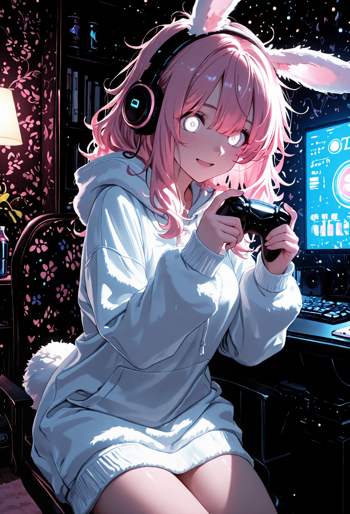

# Saya Couple

> I wanted two characters and a background to stop fighting each other. This got slightly out of hand.

Saya Couple is a ComfyUI custom node pack **plus a small patch to ComfyUI's attention code**. One generation gets
three separate prompts that actually work together:

- **MAIN**: the world. Scene, background, mood, colours, composition.
- **P1**: the first character's identity and attributes.
- **P2**: the second character's identity and attributes.

One switch turns the whole pipeline into **Solo mode** (MAIN + P1, one character, no couple machinery at all).

| Couple mode | Solo mode |
|:---:|:---:|
|  |  |
| demo workflow, MAIN + P1 + P2 | full workflow, MAIN + P1 only |

Current version: **0.3.0** ([CHANGELOG.md](CHANGELOG.md)). Tested on ComfyUI `41db8f4f` (v0.34.0+77), Linux, AMD
RDNA4 16 GB. It is first and foremost **a backup of my own ComfyUI setup**, made public in case it helps someone
with the same problem. Take what you need.

> ### ⚠️ Saya Couple modifies ComfyUI's own files
> It is not a plain "drop it in `custom_nodes`" extension. A ComfyUI update can overwrite the patch, another
> extension can touch the same files, an untested ComfyUI version may or may not work, and the optional AMD patch
> changes how models are loaded and unloaded.
>
> **Back up your ComfyUI installation before installing.** The installer checks compatibility first, keeps its
> own backup, verifies hashes and can restore, but your own copy is the one you can trust. The changes are small
> text patches and they can be reverted. **Use at your own risk.**

---

**Contents** ·
[Quick start](#quick-start) ·
[Couple and Solo](#couple-mode-and-solo-mode) ·
[What's in the box](#whats-in-the-box) ·
[Workflows](#workflows) ·
[How it works](#how-it-works) ·
[Installation in detail](#installation-in-detail) ·
[Verify / Restore](#verify--restore) ·
[AMD VRAM patch](#amd-vram-safety-patch-optional) ·
[Compatibility](#compatibility) ·
[Testing](#testing-methodology) ·
[Known limitations](#known-limitations) ·
[Licenses](#reuse-contributions-and-licenses)

---

## Quick start

For a first run you only need the demo workflow. It takes about ten minutes.

1. **Back up your ComfyUI folder** (copy it somewhere).
2. **Install the two custom nodes it depends on**: [MultiMaskCouple](THIRD_PARTY_NOTICES.md) (required) and
   [RES4LYF](THIRD_PARTY_NOTICES.md) (for the demo samplers). ComfyUI-Manager works for both.
3. **Install Saya Couple** (it checks your ComfyUI first and changes nothing if something is wrong):

   ```bash
   git clone https://github.com/alphaziod/saya-comfy-couple-plus saya-couple
   cd saya-couple
   ./saya install --comfyui /path/to/ComfyUI     # Windows: saya.bat install --comfyui C:\path\to\ComfyUI
   ```

4. **Restart ComfyUI**, open `workflows/Saya_Couple_Demo.json`, select your SDXL / Illustrious model in both
   checkpoint loaders (the same model twice is fine), click **Run**.
5. Something looks wrong? `./saya verify --comfyui /path/to/ComfyUI` tells you what; `./saya restore` puts
   everything back.

Then write your own MAIN / P1 / P2 prompts. Keep the scene in MAIN and each character in their own prompt: that
separation is the whole point.

## Couple mode and Solo mode

The full workflow has one switch, **MAIN · Couple / Solo** (`Couple Mode` ON / OFF). It is the only authority:
every phase derives its behaviour from it, and nothing else can contradict it.

| Pass | Couple mode (ON) | Solo mode (OFF) |
|---|---|---|
| Phase 1 · base sampling | Saya dual attention: MAIN + P1 in its region + P2 in its region | MAIN + P1, no region, models unpatched |
| Hires Fix, Phase 6 (full frame) | MultiMaskCouple regional attention | plain MAIN + P1 |
| USDU tiles, detailers (crops) | crop-aware couple attention: each tile/crop gets its own slice of the masks | no couple patch, no crop |
| Phase 3 · HiDream refine | two regions (P1, P2), text strictly separated | one global prompt (MAIN + P1), no regional patch |

Solo is not "Couple with the masks turned off": the couple nodes, patches and regional conditionings are not run at
all. The demo workflow is Couple only.

## What's in the box

| Part | What it is | Needed? |
|---|---|---|
| **Core patch** `comfy/ldm/modules/attention.py` | makes MAIN / P1 / P2 cooperate inside cross-attention | **required** for the couple mode |
| **Custom node pack** `custom_nodes/Saya_Couple/` (53 nodes) | the couple nodes, plus the nodes my own workflow uses (phase checkpoints, HiDream helpers, upscale / detail passes, lazy loaders…) | install it all, ignore what you don't use |
| **AMD VRAM safety patch** `comfy/model_management.py` | keeps ROCm from starving the Linux desktop of VRAM | optional, AMD only |
| **Installer** `./saya` | install / verify / restore / check-compat | recommended |
| **Demo workflow** | MAIN / P1 / P2 + the two sampling passes, nothing else | start here |
| **Full workflow** | my complete 6-phase pipeline, cleaned for publication | when you want everything |
| **Tests & tools** | proofs, installer scenarios, test campaigns | if you're curious |

## Workflows

### Demo (simple)

`workflows/Saya_Couple_Demo.json`: **select your SDXL / Illustrious model, then click Run.**

Deliberately bare: two checkpoint loaders, MAIN / P1 / P2 / negative, the Saya split mask and Multi Couple, the two
Shark samplers, decode, save. No phases, no detailers, no upscale. Random seed every run.

The sampling core is **exactly the one of my validated setup** (RES4LYF ClownsharKSampler): MODEL_1 base pass
16 steps / 13 run / cfg 6 with Epsilon Scaling → CFGZeroStar → APG → PAG and DetailBoost, then MODEL_2 refine pass
3 steps / denoise 0.5 / cfg 2. The gain 0.78 lives in the patched core, not in the graph. The prompts
(`workflows/demo_prompt.json`) are the ones used for the gain campaigns: two adult characters in a seated hug, a
dense multicoloured gamer room.

### Full (6 phases)

`workflows/Saya_Couple_Full.json`: the pipeline I actually use, with phase checkpoints and review gates.

| Phase | What it does |
|---|---|
| 1 · Base | two-pass Saya couple sampling, then a review gate (continue / redo) |
| 2 · Hires & USDU | hires fix (full frame) and two tiled Ultimate SD Upscale passes (crop-aware) |
| 3 · HiDream | HiDream I1 refine: two text regions (P1 / P2) in Couple, one global prompt in Solo |
| 4 · Pre-detail | light hires refine before the detailers |
| 5 · Detailers | 13 detailer slots (Detailer 01 … 13), crop-aware couple attention |
| 6 · Final | Remacri upscale, then **Naturalize V2**: one light diffusion with the real MAIN / P1 / P2 conditioning, colour lock, highlight taming, soften, grain |

Cleaned for publication **without simplifying it**: same nodes, same wiring, same sampler and pass settings. Only
these were neutralised: checkpoints, VAEs, LoRAs (stacks shipped empty), detector models (`SELECT_*`
placeholders), prompts (same as the demo) and personal notes. Choose a detector model for each detailer slot you
want and bypass the others with their toggles. Download `4x_foolhardy_Remacri.pth` into `models/upscale_models`
(or pick another upscaler in *MAIN · Final Upscale Preset & Model*).

It needs many other custom nodes (RES4LYF, Ultimate SD Upscale, Impact Pack + Subpack, GGUF, KJNodes, rgthree,
LoRA Manager, Fearnworks, DaSiWa, JPS); the list with links and licenses is in
[THIRD_PARTY_NOTICES.md](THIRD_PARTY_NOTICES.md). The 6-phase run is validated on my own install, with my models.

**Older saved workflows** load as they are: the removed *Use Couple Crop* switch is migrated on load by the
frontend, and the USDU nodes then show a new `solo` input to connect to the Couple / Solo switch. If you customised
the 0.2.0 Full workflow, `python3 tools/migrate_workflow_v030.py old.json new.json` applies every 0.3.0 change
(including the two-region HiDream) and refuses to write anything if your graph does not have the expected shape.

## How it works

### The couple attention (Phase 1)

For every cross-attention layer of the model that runs the couple (MODEL_1):

1. **MAIN** is computed exactly as ComfyUI normally does (native path).
2. **P1** and **P2** are computed separately, with the same layer, on the conditional rows only.
3. Inside each character's mask, the character's difference from MAIN (its **delta**) is added on top of MAIN.
   The part of the delta that would cancel MAIN is removed ("locked" orthogonal to MAIN), so a character adds
   information without erasing the scene.
4. The negative / unconditional side stays pure MAIN.

```
OUT = MAIN + g × (D1_locked + D2_locked)
```

The lesson from many failed attempts (weights, scheduling, mask variants, routing, alternative cores; see
[docs/DEVELOPMENT_HISTORY.md](docs/DEVELOPMENT_HISTORY.md)): **before tuning how strong MAIN, P1 and P2 are, you
first have to control *how* they interact inside attention.** That needed a core modification. Once the interaction
was clean, the balance became a single knob, `g`.

| g | what tends to happen |
|---|---|
| too low (≈ 0.5) | MAIN gets strong (richer, more colourful background), characters start losing attributes |
| too high (≥ 0.83) | the characters take over the frame; MAIN loses objects and detail |
| **≈ 0.78** | current compromise: MAIN, P1 and P2 all contribute |

The goal is not "zero defects". It is that **MAIN, P1 and P2 can all contribute together.**

The couple mode is **fail-closed**: other extensions that hook cross-attention (attn2 patches, attn2 replacements,
attention overrides) raise a clear error in that mode instead of being silently mixed in.

### Recommended balance

```python
# comfy/ldm/modules/attention.py
SAYA_LOCKED_DELTA_PERSON_GAIN = 0.78
```

- **1.0** is the **neutral reference**, proven bit-identical to the patch before the gain existed.
- **0.78** is the **current recommended value**, chosen after pure-RNG campaigns and tests across ten different
  environments. It suits *my models and prompts*; a nearby value may suit yours better.

To change it, edit that line and restart ComfyUI. There is deliberately no widget for it.

### The other passes

- **Full-frame passes** (Hires Fix 1 / 3, Phase 6) use MultiMaskCouple regional attention, rebuilt at the current
  resolution from the couple *imprint* (the prompts and geometry saved with the Phase 1 image).
- **Tiled / cropped passes** (USDU, detailers) use a crop-aware couple attention: each tile or crop receives its own
  slice of the full-image masks, so P1 and P2 stay on the right side inside the tile.
- **HiDream (Phase 3)** has no SDXL-style cross-attention to patch: image and text share one joint attention.
  RES4LYF's regional mask restricts every image token to the text of its own region (P1 or P2, each carrying
  MAIN), in all 48 blocks. Exactly two regions are used on purpose: with a third one, RES4LYF's text mask lets P1's
  text tokens see P2's.

## Installation in detail

Requirements: ComfyUI **v0.23.0+** (see [Compatibility](#compatibility)), the custom node **MultiMaskCouple**, and
**RES4LYF** for the workflows.

```bash
./saya check-compat --comfyui /path/to/ComfyUI      # read-only
./saya install      --comfyui /path/to/ComfyUI
```

What `install` does:

1. finds ComfyUI and its Python (`.venv`, `venv`, `python_embeded`, or `--python`);
2. reads its version / commit and **checks compatibility** on three axes;
3. shows exactly which core files will change and asks for confirmation;
4. backs up every file it will touch (`ComfyUI/.saya_backups/<date>/`, with sha256 and ComfyUI version);
5. applies the required attention patch (no git needed; a patch that does not match exactly is refused);
6. installs `custom_nodes/Saya_Couple`;
7. offers the AMD patch only when it makes sense;
8. checks hashes, runs quick smoke tests (core import, Saya path live, gain value, pack import) and prints a report.

If a required check fails, **nothing is modified**. Re-running `install` is safe (idempotent). `--dry-run` shows
everything without writing; `--full` also runs the pack's test suite. Updating from an older Saya Couple: run
`./saya install` again, then `./saya verify`.

### Core files modified

Verified against upstream: exactly **two** ComfyUI files are touched, nothing else in the core.

- **Required: `comfy/ldm/modules/attention.py`.** Adds the Saya cross-attention path, used only when a model
  carries `saya_dual_mode` (set by the Saya Multi Couple node): MAIN native, P1/P2 on conditional rows,
  `main_locked_delta` fusion, `SAYA_LOCKED_DELTA_PERSON_GAIN = 0.78`, fail-closed hook checks. Without the flag
  the file behaves exactly like upstream (tested bit-identical). About 120 added lines, one changed line
  (`if` → `elif`). Patch: `patches/saya_dual_attention.patch`.
- **Optional: `comfy/model_management.py`.** About 20 lines, active only on AMD GPUs under ROCm. See below.
- **Custom node files**: `custom_nodes/Saya_Couple/` is a normal custom node folder. The per-file list with
  sha256, origin and license is in `MANIFEST.json`.

## Verify / Restore

After a ComfyUI update, or when something looks off:

```bash
./saya verify --comfyui /path/to/ComfyUI
```

Short, paste-able report: ComfyUI version / commit, compatibility status, attention patch `OK / MODIFIED / MISSING`,
custom node `OK / INCOMPLETE`, AMD patch `ACTIVE / NOT INSTALLED / INCOMPATIBLE`, hashes, dependencies, known
conflicts, quick tests. If you open an issue, please include it: *"Run `./saya verify` and paste the output."*

```bash
./saya restore --comfyui /path/to/ComfyUI
```

puts back **exactly** the files saved before the first install (never a guessed upstream file) and removes the
custom node. If a file changed after the install (update, manual edit), it tells you and asks before overwriting.

## AMD VRAM safety patch (optional)

On Linux with amdgpu, ROCm allocations cannot be evicted for other programs. When PyTorch fills the VRAM, the
desktop compositor can fail to allocate and the **whole graphical session can freeze or die**. Switching between big
models (SDXL → HiDream + LoRA) could also run out of memory.

The patch (a no-op on NVIDIA, CPU and anything that is not ROCm):

- caps ComfyUI's VRAM at startup to *free VRAM − 1 GiB* kept for the desktop, and makes loading decisions respect it;
- unloads models **fully** instead of partially, so gigabytes of the old model don't stay next to the new one;
- never grows an already partially loaded model back into the headroom reserved for activations and LoRA patching.

| AMD VRAM | Installer suggestion |
|---|---|
| ≤ 16 GB | strongly recommended for heavy workflows like mine (asks, default yes, you can refuse) |
| 16 – 24 GB | recommended with big models / heavy workflows (asks, default yes, you can refuse) |
| ≥ 24 GB | information only: generally not needed, not applied (`./saya amd --yes` if you want it) |

NVIDIA users are never offered it. You always keep the choice: `./saya amd --check | --yes | --revert`. Launch
flags I use with it: `--disable-dynamic-vram --reserve-vram 0.75`.

## Compatibility

Compatibility is decided from **what your ComfyUI's code actually provides**, not from its version number. An old
version is never refused just for being old.

| Status | Meaning |
|---|---|
| **OFFICIALLY TESTED** | every key core file is byte-identical to the version validated with real generations |
| **POTENTIALLY SUPPORTED** | all structures / APIs Saya uses are present and the patch applies; not validated with real generations |
| **UNSUPPORTED** | something required is missing, or the patch does not apply → the installer changes nothing |

It is checked on three separate axes:

- **A. Saya attention core**: does the patch apply, and are the runtime hooks it uses present (`cond_or_uncond`,
  `activations_shape`, attention backends accepting `transformer_options`)?
- **B. Custom node pack**: are all 128 ComfyUI imports / symbols the pack uses present (for example
  `comfy.model_base.Anima` and `model_management.unload_model_and_clones`), and is **MultiMaskCouple** installed?
- **C. AMD patch**: does it apply to your `model_management.py`?

Tested setup (OFFICIALLY TESTED): ComfyUI `41db8f4f` (v0.34.0 + 77 commits, 2026-09-08), Linux, AMD Radeon RX 9060 XT
16 GB (RDNA4), ROCm 7.13, PyTorch 2.13, Python 3.12, PyTorch attention.

Static scan of past releases (`compatibility.json`, `tools/scan_history.py`):

| ComfyUI | A. attention | B. pack | C. AMD patch |
|---|---|---|---|
| ≤ v0.3.59 | UNSUPPORTED (attention backends don't take `transformer_options`) | UNSUPPORTED | UNSUPPORTED |
| v0.3.69 – v0.22.x | POTENTIALLY SUPPORTED | UNSUPPORTED (APIs added later) | POTENTIALLY SUPPORTED |
| v0.23.0 – v0.37.4 | POTENTIALLY SUPPORTED | POTENTIALLY SUPPORTED | POTENTIALLY SUPPORTED |

So in practice: **v0.23.0 or newer** is needed; only the tested commit is OFFICIALLY TESTED. Run
`./saya check-compat` on your own install; it is the answer that counts.

## Testing methodology

0.78 is not based on one pretty picture:

- **Non-regression**: pack test suite (135 tests), bit-identical proofs (`tests/proof_gain.py`: g = 1.0 equals the
  pre-gain code, only the character deltas are scaled, MAIN and unconditional rows untouched), installer scenarios
  (`tests/installer_scenarios.py`: install, verify, idempotence, restore, drift, conflicts, NVIDIA/AMD simulations,
  old version).
- **Pure-RNG campaigns**: a new random seed per image, 10 images per gain value from 0.68 to 0.83, plus earlier
  0.5 / 0.75 / 0.85 / 1.0 comparisons.
- **Ten environments** at 0.78 (café, beach, winter market, library, festival, rooftop, and four harder fantasy /
  steampunk / cyberpunk / forest scenes).
- **Judged on harmony**: are MAIN, P1 and P2 all clearly expressed? Small local attribution mistakes were tolerated.
- **Refactors are checked pixel for pixel**: 0.3.0's cleanup gives bit-identical images on every phase of full
  Couple and Solo runs.
- **Every validated state archived with sha256 manifests.**

Tools to rerun it yourself: `tests/run_campaign.py` (RNG and themed campaigns), `tests/contact_sheet.py`.
Full story: [docs/DEVELOPMENT_HISTORY.md](docs/DEVELOPMENT_HISTORY.md).

## Known limitations

- **Core patch**: ComfyUI updates can break it. Run `./saya verify` after every update.
- **Validated on one setup only** (AMD RDNA4 16 GB, Linux, ROCm, PyTorch attention). NVIDIA, Windows and other
  attention backends pass the static checks but were not validated with real generations. `saya.bat` is untested.
- **SDXL / UNet only** for the couple attention (plus HiDream through RES4LYF in Phase 3); other architectures and
  temporal blocks are refused on purpose.
- **Fail-closed couple mode**: extensions that hook cross-attention cannot be combined with it.
- **Attribute swaps happen**: with two masked characters the model sometimes gives an attribute (ears, eye colour)
  to the wrong one, mostly in Phase 1 and 2. Later passes keep what they receive; `g` does not remove it.
- **Hard themes**: a third element (a creature, a specific prop) and very specific background details can be dropped.
- **`g` is a code constant**, not a UI setting; changing it needs a restart.
- **Optional nodes** rely on other packs: the USDU pass nodes on ComfyUI_UltimateSDUpscale (per-tile couple masks
  need `patches/third_party/ultimatesdupscale_saya_couple_crop.patch`, not installed by the installer), the detailer
  node on the Impact Pack. No detector model is shipped. The USDU node sets `SAYA_USDU_COUPLE_CROP` itself for each
  pass: do not export it globally in your shell.
- **Detailer crop position** only works with an **empty wildcard**: a wildcard can reorder or skip SEGS, so the
  position is then not attached (one warning per detailer call) rather than risk a wrong one.
- **HiDream negative prompt**: with regional conditioning, RES4LYF repeats the negative over each region's token
  length, so each region sees the negative slightly duplicated or truncated instead of exactly once.
- **Tiny eye details**: a light pink dot can appear in white pupils after the HiDream pass; Phase 6 no longer
  amplifies it, but it does not remove it either.

## AI-assisted development

**This project was heavily AI-assisted.** AI models helped read and analyse ComfyUI's code, implement, test,
diagnose, audit, write the installer and this documentation.

What stayed human: the goals, the expected behaviour, the visual evaluation of every campaign, and the decisions to
keep or reject approaches. An alternative "dual-stream" core was dropped on visual results even though some numbers
looked better. Changes were tested, compared with previous states, archived and audited before being kept, not
generated and published as-is.

## Personal project note

I'm not a professional developer. This started because ComfyUI didn't do exactly what I wanted, and I ended up
modifying its attention. This repository is my setup: nodes I actually use, tools most people will never need,
experimental patches that became stable, and the scripts that tested them. Install everything and ignore what you
don't need, or take one piece.

## Reuse, contributions and licenses

If something here helps you, feel free to **reuse, adapt, fork or rewrite it**: only the attention patch, only the
nodes, only the test scripts. I'm fine with that. The project exists to back up my work and maybe save someone a
few weeks. Issues and PRs are welcome; this is a personal project maintained when I have time.

| What | License |
|---|---|
| Saya Couple's own code (pack, installer, tests, tools, docs) | **GPL-3.0-or-later**: `LICENSE` |
| Core patches and patched reference files (they modify ComfyUI) | **GPL-3.0**, ComfyUI's license |
| `src/ppm_vendor/**` and `src/nodes/saya_attention_couple.py` (from ComfyUI-ppm) | **AGPL-3.0-or-later**: they stay AGPL here, each file says so (`SPDX` header), text in `LICENSES/AGPL-3.0.txt` |
| Dependencies you install yourself (MultiMaskCouple, RES4LYF, …) | their own licenses. **RES4LYF adds a restriction on commercial services** |

The repository has one main license but contains components under other licenses; nothing here relicenses them.
Details and attributions: [THIRD_PARTY_NOTICES.md](THIRD_PARTY_NOTICES.md).
